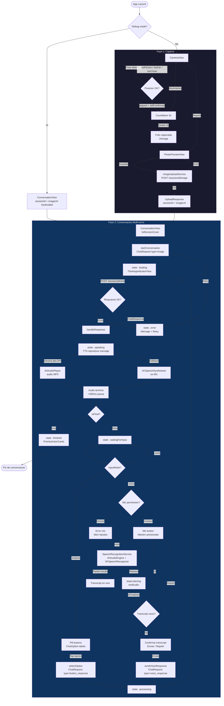
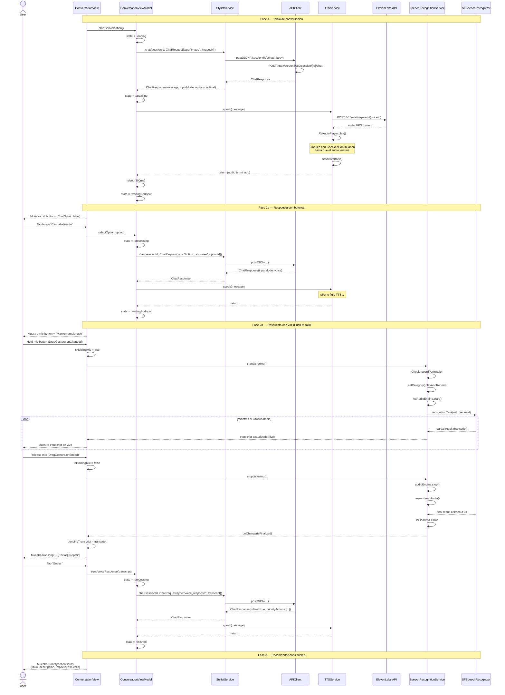
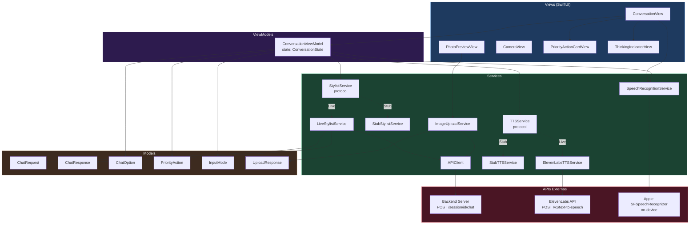
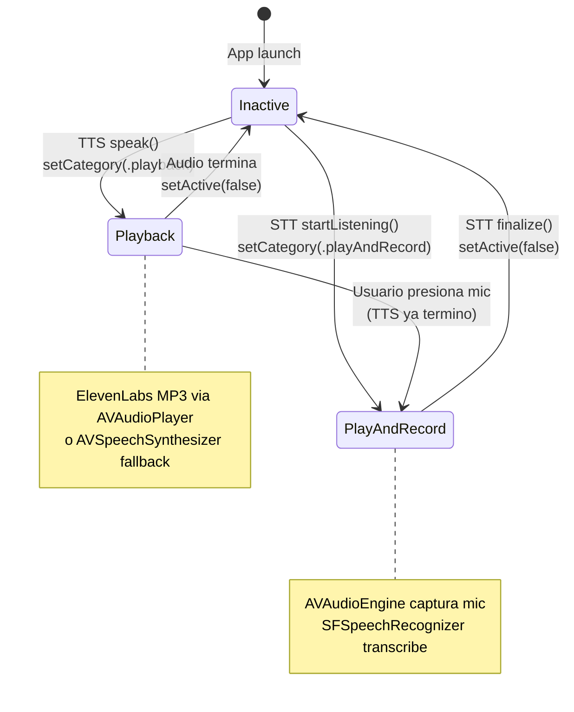

# Diagramas de Arquitectura — guaperrimo.ai iOS

## 1. Diagrama de Flujo (Estado del sistema)

## 2. Diagrama de Secuencia (Interaccion entre modulos)

## 3. Diagrama de Modulos y Dependencias

## 4. Estado compartido entre modulos

| Dato | Origen | Consumidores | Tipo |
|------|--------|-------------|------|
| `sessionId` | PhotoPreviewView (UUID) | ConversationViewModel → StylistService | `String` |
| `imageUrl` | UploadResponse.url | ConversationViewModel → ChatRequest | `String` |
| `state` | ConversationViewModel | ConversationView (switch UI) | `ConversationState` |
| `currentMessage` | ChatResponse.message | ConversationView (texto), TTSService (audio) | `String` |
| `currentOptions` | ChatResponse.options | ConversationView (pill buttons) | `[ChatOption]` |
| `currentInputMode` | ChatResponse.inputMode | ConversationView (buttons/voice/none) | `InputMode` |
| `priorityActions` | ChatResponse.priorityActions | ConversationView → PriorityActionCardView | `[PriorityAction]` |
| `isSpeaking` | ConversationViewModel | ConversationView (deshabilita input) | `Bool` |
| `transcript` | SpeechRecognitionService | ConversationView (live text + confirm) | `String` |
| `isFinalized` | SpeechRecognitionService | ConversationView (onChange → pendingTranscript) | `Bool` |
| `isListening` | SpeechRecognitionService | ConversationView (UI mic button) | `Bool` |
| `isHoldingMic` | ConversationView (local) | ConversationView (gesture + UI) | `Bool` |
| `pendingTranscript` | ConversationView (local) | ConversationView (confirm UI) | `String?` |

## 5. Ciclo de vida del Audio Session

